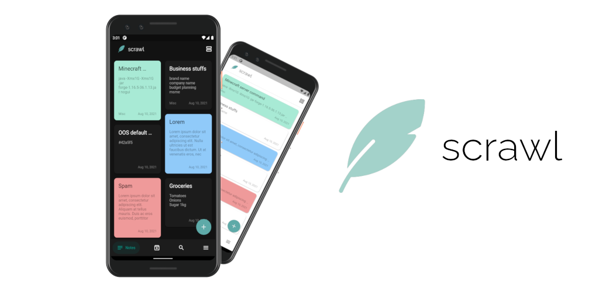

<h1> scrawl - Take Notes Easily</h1>

 
 

## Description
A simple notes app with offline and online backup. Uses Nextcloud to store your backup. Assign labels, set colours for notes. Search your notes easily. You can even archive your notes.

### To-do

- [x] Archive option
- [x] Label notes
- [x] Backup and Restore to Downloads folder
- [x] Backup and Restore via Nextcloud
- [x] Search notes
- [ ] 'scrawl' Cloud Sync
- [ ] Desktop Support
- [ ] Web Support