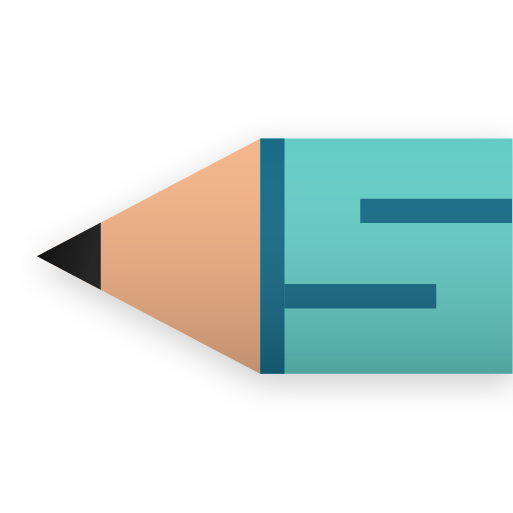

# scrawler

A Simple Note Taking App

---

## Features
- Supports Markdown
- Supports Windows/macOS/Linux (Android & iOS coming soon)
- Search notes
- Labels for notes (coming soon)
- Color tags (coming soon)
- Tasks (coming soon)
- Local user (Optional)
- 'scrawler' cloud sync
- Smooth UI
- Web portal

---

## Downloads
### [scrawler.net](http://scrawler.net/#/downloads)

---

## Platform
 - [ ] Android ```coming soon```
 - [ ] iOS ```coming soon```
 - [x] Windows ```work in progress```
 - [x] macOS ```work in progress```
 - [x] Linux(Ubuntu/Debian) ```work in progress```
 - [x] Web ```maybe in the future```

---

## Compiling the app
Before anything, be sure to have a working flutter sdk setup.If not installed, go to [Install - Flutter](https://docs.flutter.dev/get-started/install).

Be sure to disable signing on build.gradle or change keystore to sign the app.

For now the required flutter channel is master, so issue those two commands before starting building:
```
$ flutter channel master
```
```
$ flutter upgrade
```

After that, building is simple as this:
```
$ flutter pub get
```
```
$ flutter run
```
```
$ flutter build platform-name
```

---

## Contributing

Feel free to open a PR to suggest fixes, features or whatever you want, just remember that PRs are subjected to manual review so you gotta wait for actual people to look at your contributions.
