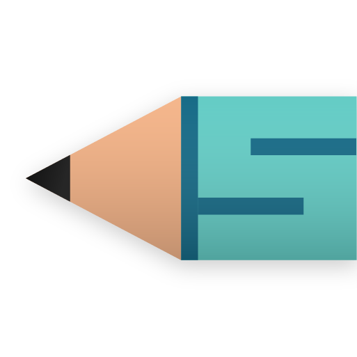
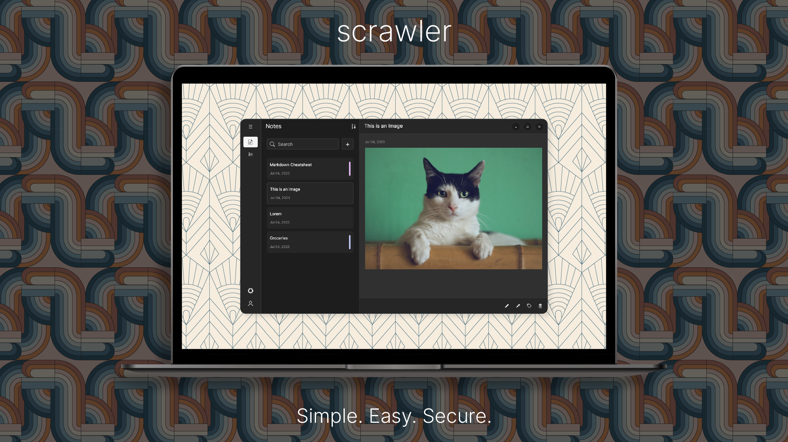

# scrawler - A Simple Nextcloud Note Client App



## About

A Simple Nextcloud Notes Client App. You can connect to your Nextcloud account and manage the notes.

## Features
- [x] Supports Markdown
- [ ] Supports Android & iOS (Windows/macOS/Linux coming soon)
- [ ] Search notes
- [x] Note Categories
- [x] Smooth UI
- [x] Allow Insecure Connection for debug mode and also for self hosted Nextcloud on local server.

---

## Platform
 - [x] Android
 - [ ] iOS ```coming soon```
 - [ ] Windows ```coming soon```
 - [ ] macOS ```coming soon```
 - [ ] Linux (Ubuntu/Debian) ```coming soon```

---

## Compiling the app
Before anything, be sure to have a working flutter sdk setup.If not installed, go to [Install - Flutter](https://docs.flutter.dev/get-started/install).

Be sure to disable signing on build.gradle or change keystore to sign the app.

For now the required flutter channel is master, so issue those two commands before starting building:
```
$ flutter channel master
```
```
$ flutter upgrade
```

After that, building is simple as this:
```
$ flutter pub get
```
```
$ flutter run
```
```
$ flutter build platform-name
```

---

## Contributing

Feel free to open a PR to suggest fixes, features or whatever you want, just remember that PRs are subjected to manual review so you gotta wait for actual people to look at your contributions.
